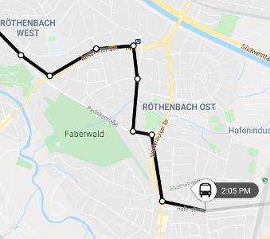
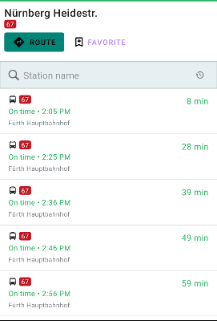

## ServiceStopMapFragment



The [`ServiceStopMapFragment`](tripkit-android/com.skedgo.tripkit.ui.map.servicestop/-service-stop-map-fragment/index.md) displays a particular scheduled service's route.

````xml tab="Layout"
    <fragment
            android:id="@+id/mapFragment"
            class="com.skedgo.tripkit.ui.map.servicestop.ServiceStopMapFragment"
            android:layout_width="match_parent"
            android:layout_height="match_parent" />
````

To tell it which route to display, call the [`setService`](tripkit-android/com.skedgo.tripkit.ui.map.servicestop/-service-stop-map-fragment/set-service.md) function with a [`TimetableEntry`](tripkit-android/com.skedgo.tripkit.ui.model/-timetable-entry/index.md), or if you are using a [TimetableFragment](stop_detail.md#TimetableFragment),
you can give the map to it and it will automatically display routes when the entries are clicked.

## TimetableFragment



The [`TimetableFragment`](tripkit-android/com.skedgo.tripkit.ui.timetables/-timetable-fragment/index.md) lists all scheduled services for a particular stop. If you pass it a [ServiceStopMapFragment](stop_detail.md#ServiceStopMapFragment),
it will automatically call `setService` when the user clicks on a particular service. You can also do that manually from a [`OnTimetableEntrySelectedListener`](tripkit-android/com.skedgo.tripkit.ui.timetables/-timetable-fragment/-on-timetable-entry-selected-listener/index.md).

Like a few of the fragments in the [Trip Results](trip_results.md), you can display your own custom buttons.

````kotlin tab="Kotlin"
    var timetableFragment = com.skedgo.tripkit.ui.timetables.TimetableFragment.Builder()
            .withStop(location)
            .withButton("route", R.layout.route_button)
            .withButton("favorite", R.layout.bookmark_button)
            .build()
````

When the user clicks a particular timetable entry, the [`OnTimetableEntrySelectedListener`](tripkit-android/com.skedgo.tripkit.ui.timetables/-timetable-fragment/-on-timetable-entry-selected-listener/index.md) will be called.

````kotlin tab="Kotlin"
    // If we add our ServiceStopMapFragment as a listener, it will automatically display a selected timetable entry.
    timetableFragment.addOnTimetableEntrySelectedListener(mapFragment)
    timetableFragment.addOnTimetableEntrySelectedListener { timetableEntry, scheduledStop, minStartTime ->
        // Perhaps you'd like to show the service detail now?
    }
````

And when they click on any of the [`TripKitButtons`](tripkit-android/com.skedgo.tripkit.ui.model/-trip-kit-button/index.md) that you provided, the [`OnTripKitButtonClickListener`](tripkit-android/com.skedgo.tripkit.ui.timetables/-timetable-fragment/-on-trip-kit-button-click-listener/index.md) will be called.

````kotlin tab="Kotlin"
    timetableFragment.setOnTripButtonClickListener { id, scheduledStop ->
        if (id == "route") {
            Toast.makeText(activity, "Will route to ${scheduledStop.displayAddress}", Toast.LENGTH_SHORT).show()
        } else if (id == "favorite") {
            Toast.makeText(activity, "Will favorite ${scheduledStop.nameOrApproximateAddress}", Toast.LENGTH_SHORT).show()
        }
    }
````
## ServiceDetailFragment


To show the details about a particular service, you can use the [`ServiceDetailFragment`](tripkit-android/com.skedgo.tripkit.ui.servicedetail/-service-detail-fragment/index.md) which shows the entire scheduled
service line.  If you pass it a [ServiceStopMapFragment](stop_detail.md#ServiceStopMapFragment),
it will automatically have the map move and zoom in on the scheduled stop that a user clicks on.

You'll need to pass it a [`TimetableEntry`](tripkit-android/com.skedgo.tripkit.ui.model/-timetable-entry/index.md) and a [`ScheduledStop`](tripkit-android/com.skedgo.android.common.model/-scheduled-stop/index.md).

````kotlin tab="Kotlin"
    var fragment = ServiceDetailFragment.Builder()
                    .withTimetableEntry(timetableEntry)
                    .withStop(scheduledStop)
                    .build()
````

You can then add [`OnScheduledStopClickListeners`](tripkit-android/com.skedgo.tripkit.ui.servicedetail/-service-detail-fragment/-on-scheduled-stop-click-listener/index.md) to handle users clicking on individual stops.

````kotlin tab="Kotlin"
            fragment.addOnScheduledStopClickListener(mapFragment)
            fragment.addOnScheduledStopClickListener {
                // You could collapse a bottom sheet, for example.
            }
````