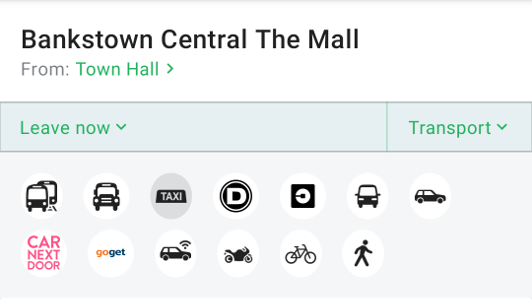
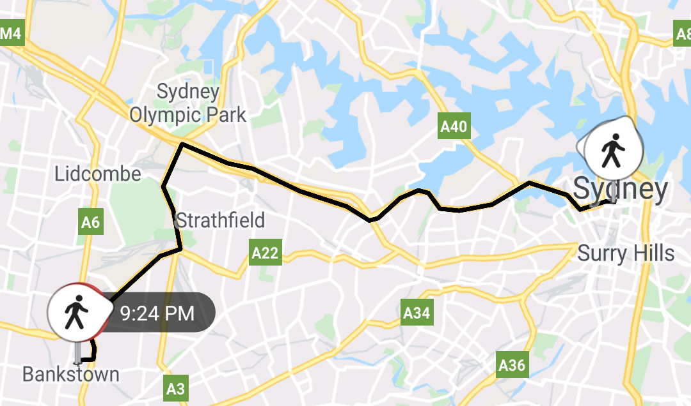

Once you have two [`Location`](tripkit-android/com.skedgo.android.common.model/-location/index.md) objects, you can get a list of routes between them, the individual services that handle those
routes, and the individual segments.
 
The [`TripResultListFragment`](tripkit-android/com.skedgo.tripkit.ui.tripresults/-trip-result-list-fragment/index.md) takes a `Query` which contains a pair of [`Locations`](tripkit-android/com.skedgo.android.common.model/-location/index.md) as well as weighting information,
and displays a list of possible routes.

## Query

To begin with, you'll need to build a [`Query`](tripkit-android/com.skedgo.android.common.model/-query/index.md) object. Queries have locations, transport mode weighting, and contain
information about transfer time and walking speed. Two [`Locations`](tripkit-android/com.skedgo.android.common.model/-location/index.md) are required, but the rest is optional.

````kotlin tab="Kotlin"
    val query = Query().apply {
        fromLocation = departureLocation
        toLocation = destinationLocation
        cyclingSpeed = 1
        walkingSpeed = 1
        environmentWeight = 0.5
        hassleWeight = 1.0
        budgetWeight = 2.0
        setTimeTag(timeTagForQuery)
    }
````

````java tab="Java"
    Query query = new Query();
    query.setFromLocation(departureLocation);
    query.setToLocation(destinationLocation);
    query.setCyclingSpeed(1);
    query.setWalkingSpeed(1);
    query.setEnvironmentWeight(0.5);
    query.setHassleWeight(1);
    query.setBudgetWeight(2);
    query.setTimeTag(timeTagForQuery);
````

| Parameter | Description |
|-----------|-------------|
| fromLocation | Sets the departure location. |
| toLocation | Sets the destination location. |
| cyclingSpeed | A value of 0, 1, or 2. *0* = slow (12 km/h), *1* = medium (18 km/h), *2* = fast (25 km/h) |
| walkingSpeed | A value of 0, 1, or 2. *0* = slow (2.5 km/h), *1* = medium (4 km/h), *2* = fast (4.5 km/h) |
| transferTime | Preferred minimum transfer time in minutes. |
| timeWeight | Part of the weighting profile specifying the user's preference for duration. It should be a value between *0.1* (unimportant) and *2.0* (important). |
| budgetWeight | Part of the weighting profile specifying the user's preference for price. It should be a value between *0.1* (unimportant) and *2.0* (important). |
| hassleWeight | Part of the weighting profile specifying the user's preference for convenience. It should be a value between *0.1* (unimportant) and *2.0* (important). |
| environmentWeight | Part of the weighting profile specifying the user's preference for environmental impact. It should be a value between *0.1* (unimportant) and *2.0* (important). |
| unit | Sets the distance unit used. It should be a string value of *"auto"*, *"imperial"* or *"metric"*|

## TripResultListFragment


Once you have your query, you can launch a [`TripResultListFragment`](tripkit-android/com.skedgo.tripkit.ui.tripresults/-trip-result-list-fragment/index.md), which displays the results of an A-to-B route 
and automatically handles date/time selection and transit mode filtering.



Transit modes are automatically saved and restored from `SharedPreferences` the next time that a trip result is displayed.

````kotlin tab="Kotlin"
    val fragment = TripResultListFragment.Builder()
            .withQuery(query)
            .build()
````

The origin and destination locations are clickable. When clicked, the fragment calls an [`OnLocationClickListener`](tripkit-android/com.skedgo.tripkit.ui.tripresults/-trip-result-list-fragment/-on-location-click-listener/index.md).

````kotlin tab="Kotlin"
    fragment.setOnLocationClickListener(
        startLocationClicked = {
            // You could show a LocationSearchFragment here
         }, 
        destinationLocationClicked = {
            // Or do nothing at all?
        })
````

When the user chooses a particular trip, the [`OnTripSelectedListener`](tripkit-android/com.skedgo.tripkit.ui.tripresults/-trip-result-list-fragment/-on-trip-selected-listener/index.md) will be called with a `ViewTrip` result. 
You can then launch a [`TripSegmentListFragment`](tripkit_map_fragment.md#TripSegmentListFragment) to display the individual segments.

````kotlin tab="Kotlin"
    fragment.setOnTripSelectedListener { viewTrip -> tripSelected(viewTrip)}
````

## TripResultMapFragment



With a ViewTrip chosen, you can display the route using a [`TripResultMapFragment`](tripkit-android/com.skedgo.tripkit.ui.tripresult/-trip-result-map-fragment/index.md). As TripKit caches route information
in the background, you only need to pass a UUID to the `withTripGroupId` function in the [`TripResultMapFragment.Builder`](tripkit-android/com.skedgo.tripkit.ui.tripresult/-trip-result-map-fragment/-builder/index.md). 

````kotlin tab="Kotlin"
    val mapFragment = TripResultMapFragment.Builder()
                                           .withTripGroupId(viewTrip.tripGroupUUID)
                                           .build()
```` 

## TripSegmentListFragment


A list of trip segments can be shown with a [`TripSegmentListFragment`](tripkit-android/com.skedgo.tripkit.ui.tripresult/-trip-segment-list-fragment/index.md). It can optionally show action buttons, in this
example, "Go" and "Favourite".

To build a [`TripSegmentListFragment`](tripkit-android/com.skedgo.tripkit.ui.tripresult/-trip-segment-list-fragment/index.md), you only need a `ViewTrip`'s UUID.

````kotlin tab="Kotlin"
    val fragment = TripSegmentListFragment.Builder()
        .withTripGroupId(viewTrip.tripGroupUUID)
        .build()
````

````java tab="Java"
    TripSegmentListFragment fragment = new TripSegmentListFragment.Builder()
                                              .withTripGroupId(tripGroup.uuid())
                                              .build();
````

If you'd also like to use buttons, pass it a list of [`TripKitButtons`](tripkit-android/com.skedgo.tripkit.ui.model/-trip-kit-button/index.md). A [`TripKitButton`](tripkit-android/com.skedgo.tripkit.ui.model/-trip-kit-button/index.md) consists of a string identifier,
which you'll receive in the button click handler, and a resource identifier for a layout which will be inflated. The
layout can contain a single `Button` if you'd like.

````xml tab="Layout"
<?xml version="1.0" encoding="utf-8"?>
<com.google.android.material.button.MaterialButton 
    xmlns:android="http://schemas.android.com/apk/res/android"
    xmlns:app="http://schemas.android.com/apk/res-auto"
    android:layout_width="wrap_content"
    android:layout_height="wrap_content"
    android:text="Go"
    app:backgroundTint="@color/colorPrimary"
    android:drawableLeft="@drawable/ic_directions"
    android:theme="@style/Theme.MaterialComponents"
    style="@style/Widget.MaterialComponents.Button.UnelevatedButton"/>

````

````kotlin tab="Kotlin"
        val buttonList = listOf(TripKitButton("go", R.layout.go_button), 
                                TripKitButton("favorite", R.layout.favourite_button))

        val fragment = TripSegmentListFragment.Builder()
            .withTripGroupId(trip!!.tripGroupUUID)
            .withButtons(buttonList)
            .build()
````

When the button is clicked, the [`TripSegmentListFragment.OnTripKitButtonClickListener`](tripkit-android/com.skedgo.tripkit.ui.tripresult/-trip-segment-list-fragment/-on-trip-kit-button-click-listener/index.md) will be called with the id of the [`TripKitButton`](tripkit-android/com.skedgo.tripkit.ui.model/-trip-kit-button/index.md) and the
current trip group.

````kotlin tab="Kotlin"
        fragment.setOnTripKitButtonListener { id, tripGroup ->  // Do something with the button }
````

## TripResultPagerFragment

To provide a more convenient user interface, the [`TripResultPagerFragment`](tripkit-android/com.skedgo.tripkit.ui.tripresult/-trip-result-pager-fragment/index.md) bundles all of the possible [`TripSegmentListFragments`](trip_results.md#TripSegmentListFragment)
for a given result list into a view pager, allowing the user to swipe back and forth through the routes. If it is given a
[`TripResultMapFragment`](trip_results.md#TripResultMapFragment), it will automatically change the map to display the correct route.

Like the [`TripSegmentListFragment`](trip_results.md#TripSegmentListFragment), you can pass it [`TripKitButtons`](tripkit-android/com.skedgo.tripkit.ui.model/-trip-kit-button/index.md), and provide a [`TripResultPagerFragment.OnTripKitButtonClickListener`](tripkit-android/com.skedgo.tripkit.ui.tripresult/-trip-result-pager-fragment/-on-trip-kit-button-click-listener/index.md) to receive the click events.

````kotlin tab="Kotlin"
    val pagerFragment = TripResultPagerFragment.Builder()
            .withTripButton("go",  R.layout.go_button)
            .withTripButton("favorite", R.layout.bookmark_button)
            .withMapFragment(mapFragment)
            .withViewTrip(viewTrip)
            .build()

    pagerFragment.setOnTripKitButtonClickListener { id, tripGroup ->
        if (id == "go") {
            Toast.makeText(context!!, "Will go to ${tripGroup.uuid()}", Toast.LENGTH_SHORT).show()
        } else if (id == "favorite") {
            Toast.makeText(context!!, "Will add ${tripGroup.uuid()} as a favorite", Toast.LENGTH_SHORT).show()
        }
    }
````